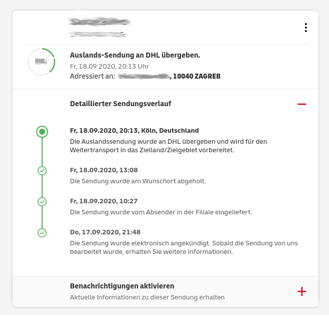
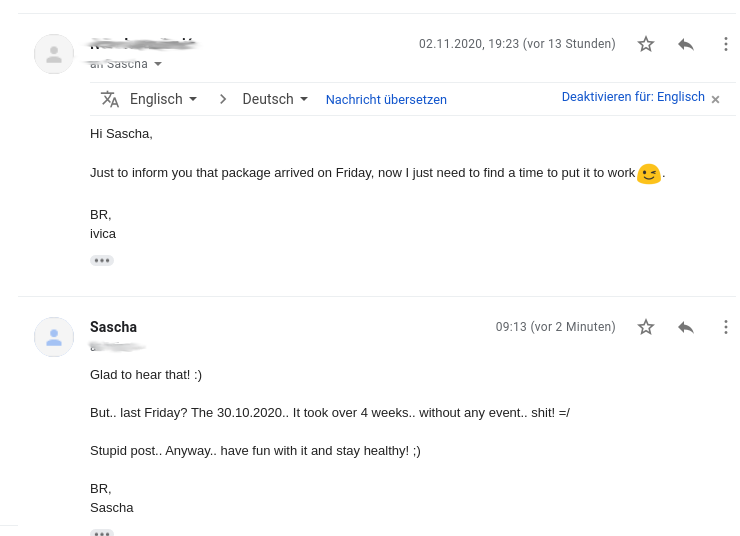
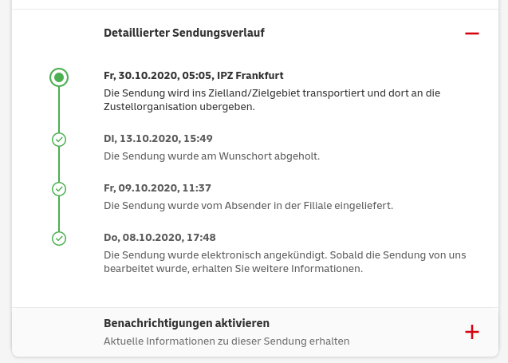
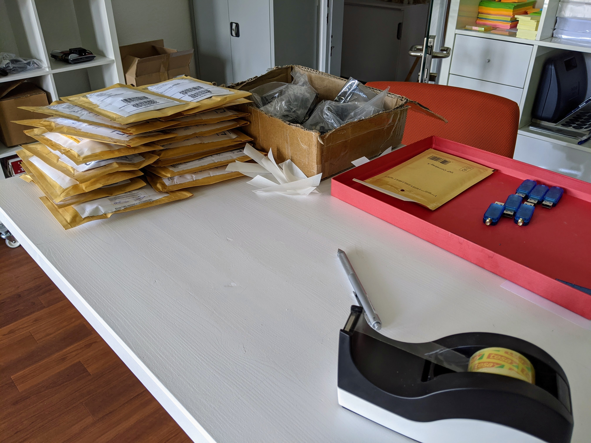
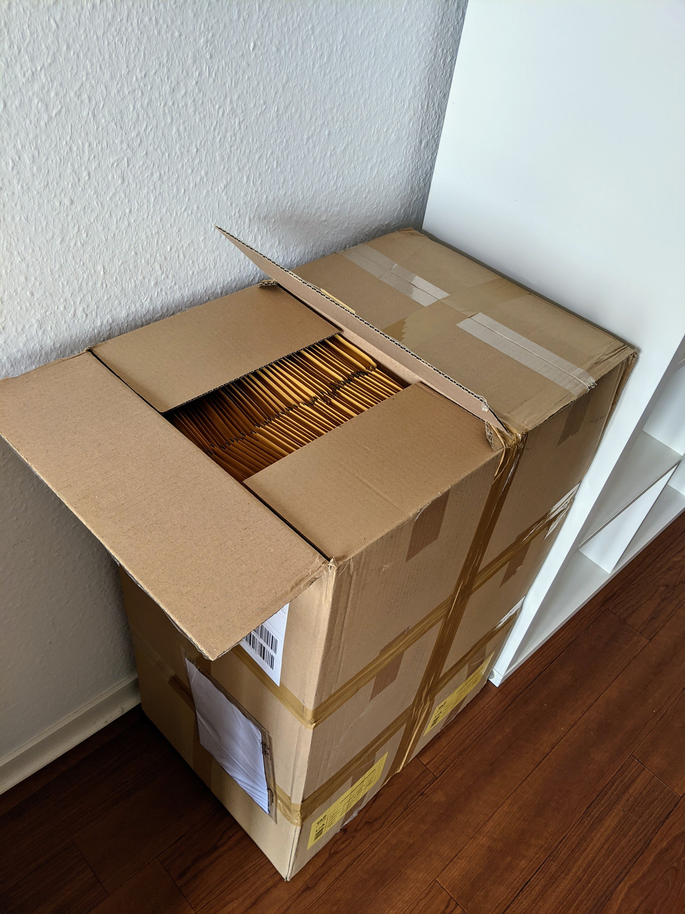
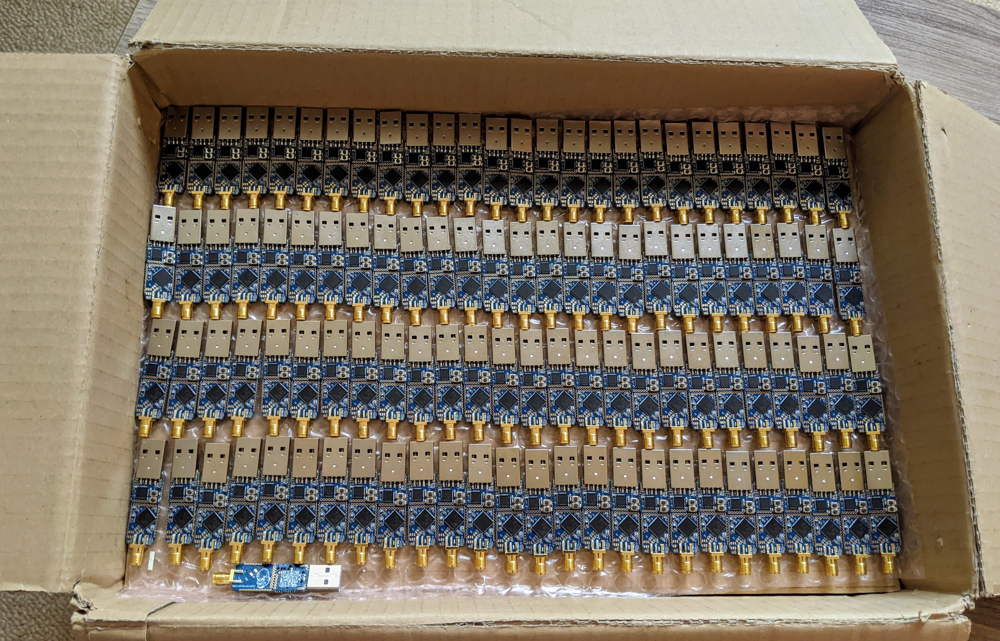

# Jan' 2021

A happy new year to all! :)

We are proud of our new "webshop", which is working fine so far. (If not, please send us your feedback)
Still needs some tweaks.. Facelift would be very cool.. But.. Yeah.. It works for now? :D
What has to be improved and will be.. Payment.. We want different options! Keep you updated ;)

Another thing.. We are trying to publish some cool projects realized with our stick..
First is the [BME680 air quality sensor](/projects/bme680/) ..
Which will follow..

- Light sensor
- BME280 temperature and humidity sensor
- movement sensor
- AC relay
- light switch
- ..

Any ideas? Something cool you ever wanted to see?
Just mail us.. ;)

# 08. Nov' 2020

I was invited to join this (the last) week a hackathon! It was so fun!

We tried to build a superfridge.. Face-recognition, bottle-counting (in and out), auto-prefill new flaschenpost-order and better invoicing.

Why that all? Cause its fun!! :D And no one wants to put lines on a paper while having one or more bottles in their hands .. ;)

Got really close to our goal.. counting the bottles was not that easy as thought..

My personal goals for the week: 

- design a 3d enclosure
- getting started with react and nextjs

My personal goals were fullfilled, enjoyed it!

We maybe will continue on it.. I will upload a video during the next days =)

# 03. Nov' 2020

Another stupid DHL/Post case popped up..

{width=600px}

It finally arrived.. Got feedback via Mail! :)

{width=600px}

.. BUT .. 6 weeks after shipping started.. without ANY event fired..

What do we learn..

1. DHL has huge problems while delivering
2. the tracking system IS NOT working

==> PLEASE JUST BE PATIENT.. PACKAGES ARRIVE.. sooner or LATER =//

# 30. Oct' 2020

While opening re-search tasks on DHL.. The number of "normal days without an event" was increased to 19 days in non EU!! :D
What the hell ..

And one parcel moved today.. after 17 days of chilling ^^ at least without firing any event in between..

{width=600px}

The worst story ever.. fasten your seatbelts .. ;D

Germany to Hungary.. Sadly one of the first packages.. Without tracking.. Took more than 60 !! days.. Even the resend parcel was there before! ;D

And guess what.. The envelope was totally destroyed and, for sure, empty.. Dear Post.. Why do you even deliver something like that?? Come on..

# 29. Oct' 2020

I am on a business trip this week. But during some meetings and in the evenings I started to build a small tool to gather all tracking-infos from our parcels.

It seems that it's working quite nice.. Found around 20 parcels with event's older than 10 days.. 

Started already re-search tasks for those parcels! Happy to tell you, that I can keep an eye on those cases now! ;)

# 23. Oct' 2020

Long time no see.. :D

What happened during the last weeks, besides from testing, packing and shipping sticks :)

We got managed to build some tools which will help us and optimize our processes!

- We are now able to automatically read the tracking-no from the PDFs generated by DHL. And feed them back into Tindie's portal.
- Invoices and DHL stickers are now printed automatically.
- I build a small tool which uses OCR to get all the "old" tracking no's from our scanned DHL-invoices and send them via email to you!

Due to another business trip I am planning the next batches and trying to close the shop only a few days!

What does not change? DHL has massive problems.. Tracking is not working properly.. Events are rarely popping up.. Really annoying! Please be patient. Luckily we can track now! ;)

# 07. Sep' 2020

Nearly all open orders are done! Thanks to all of you for your patience and support!

Preparing the stock again: Another batch of antennas just arrived..

{width=200px}
{width=200px}

# 05. Sep' 2020

Yesterdays batch was picked up, just preparing the next..!

{width=200px}

Will spend another hour in the post office later on.. :D

# 04. Sep' 2020

Another batch is getting picked up! We are good on track.. ;)

{width=200px}

# 02. Sep' 2020

Got many many new and much better envelopes today! The night can start.. Printing, packing and glueing all night long..

{width=200px}

# 18. Aug' 2020

Finally arrived back home! :fontawesome-regular-paper-plane:

Let the night-shift's begin..

# 10. Aug' 2020

New devices arrived! :fontawesome-regular-grin-hearts:

{width=400px}

8 Parcels with lots of sticks.. Let's start testing :fontawesome-regular-check-circle: