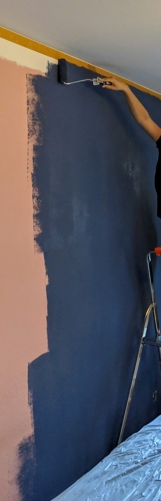
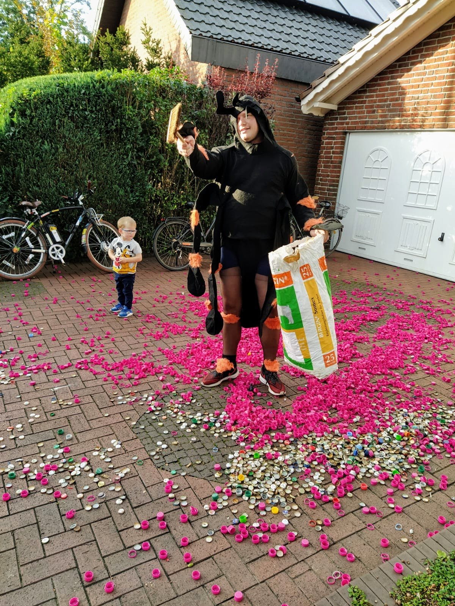

# 02. Sep' 2020

Got many many new and much better envelopes today! The night can start.. Printing, packing and glueing all night long..

{width=200px}

# 01. Sep' 2020

The guy living in my old flat contacted me.. He received another big trash-can full of destroyed and partially empty envelopes.
Seems like that nearly half of the shipped parcels (from two shipping waves) were included.. :fontawesome-regular-angry:

Started talking to my local post office once the first of you received an envelope in really bad condition!
Finally, they gave me some coupons and a special offer to add tracking to international shipments! At least for the EU, let's see how far we can get..

Still re-ordering all the envelopes, tracking back to the original orders and testing+repacking those things..

# 31. Aug' 2020

Finally found a student who will help me (since my colleague is in vacation)!!

# 29. Aug' 2020

Today we will move to another flat. (Within cologne too)
So much to do.. :(

{width=200px}

# 28. Aug' 2020

Today is my brother's 30th birthday! I had to leave to my home-town for this night.

{width=200px}

(What a stupid german thing.. not married before 30? Clean your court.. ^^)

# 20. Aug' 2020

God damn post.. Today I received plenty of destroyed and empty envelopes back! :fontawesome-regular-surprise:

{width=200px}

Some of you guys already mentioned that you received them in nearly the same condition.. Most of the are already re-shipped!

I have to sort those envelopes, test the remaining devices again and see where we get and how fast we can re-pack them!

# 18. Aug' 2020

Finally arrived back home! :fontawesome-regular-paper-plane:

Let the night-shift's begin..

# 10. Aug' 2020

New devices arrived! :fontawesome-regular-grin-hearts:

{width=400px}

8 Parcels with lots of sticks.. Let's start testing :fontawesome-regular-check-circle: