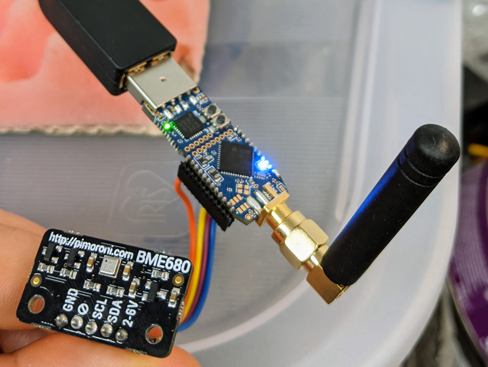
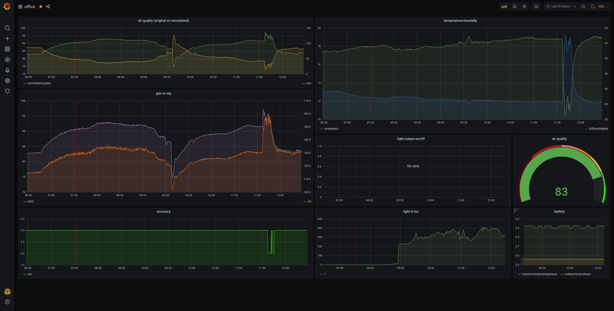

# BME680 Airquality sensor

The [BME680](https://www.bosch-sensortec.com/products/environmental-sensors/gas-sensors-bme680/){format=_blank} has the ability to measure following things:

- relative humidity
- barometric pressure
- ambient temperature
- gas (VOC)

Its super easy to use, we have to options:

- just use [Bosh's opensource driver](https://github.com/BoschSensortec/BME680_driver), to communicate with the chip and interprete that data on our own..
- or use the [BSEC library] which will to all the computations for us!

Using the [BSEC library] from Bosh we only need to write some abstraction functions like I2C communication and a getMilliSeconds function.
( A full tutorial and all the code will follow during the christmas days! )

I am using the following components for this:

- Raspberry Pi

<a href="https://www.amazon.de/LABISTS-Ultimatives-Aus-Schaltnetzteil-K%C3%BChlk%C3%B6rper-HDMI-Kabel/dp/B07W7Q6ZC9/ref=as_li_ss_il?__mk_de_DE=%C3%85M%C3%85%C5%BD%C3%95%C3%91&crid=1YBR5MUVPUSRV&dchild=1&keywords=raspberry+pi+4&qid=1608289576&quartzVehicle=812-409&refinements=p_76:419122031&replacementKeywords=raspberry+pi&rnid=419121031&rps=1&sprefix=raspberry+p,aps,191&sr=8-1-spons&psc=1&smid=AF86O3ULEWCWE&spLa=ZW5jcnlwdGVkUXVhbGlmaWVyPUExVzNMTTVCRDZBS0JWJmVuY3J5cHRlZElkPUEwMDc5MTU2MkpOQ1M0UDlVTjJJJmVuY3J5cHRlZEFkSWQ9QTAyNTYwMjIzQ0pCVUlVWjQzRVY4JndpZGdldE5hbWU9c3BfYXRmJmFjdGlvbj1jbGlja1JlZGlyZWN0JmRvTm90TG9nQ2xpY2s9dHJ1ZQ==&linkCode=li1&tag=slaesh-21&linkId=7e0dced525d7672044dacfd76832bdd2&language=de_DE" target="_blank"></a>

- BME680 sensor breakout

- [two of my sticks](/projects/cc2652) (one as an openthread border-router and one for the sensor)

How does it work?

1. Sensor is running a Openthread full device, which sends the sensor-data every 10 seconds
2. On the PI runs a Coap-to-Mqtt deamon (coap is a Openthread thing, similar to http post/get)
3. .. there is also running a Mosquitto
4. .. a InfluxDb
5. .. and a Grafana

The last will provide us easily and fast cool dashboards like this:

[BSEC library]: https://www.bosch-sensortec.com/software-tools/software/bsec/