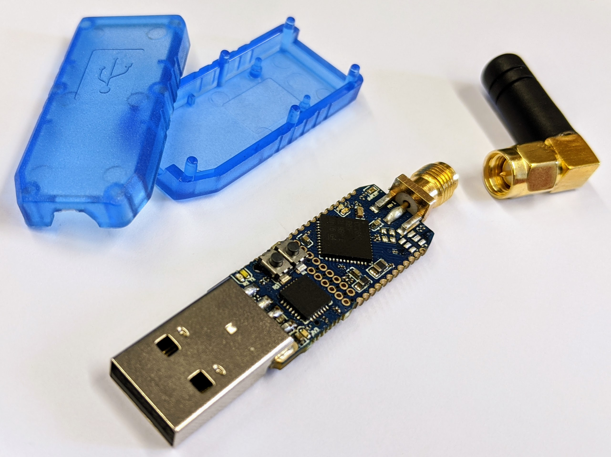
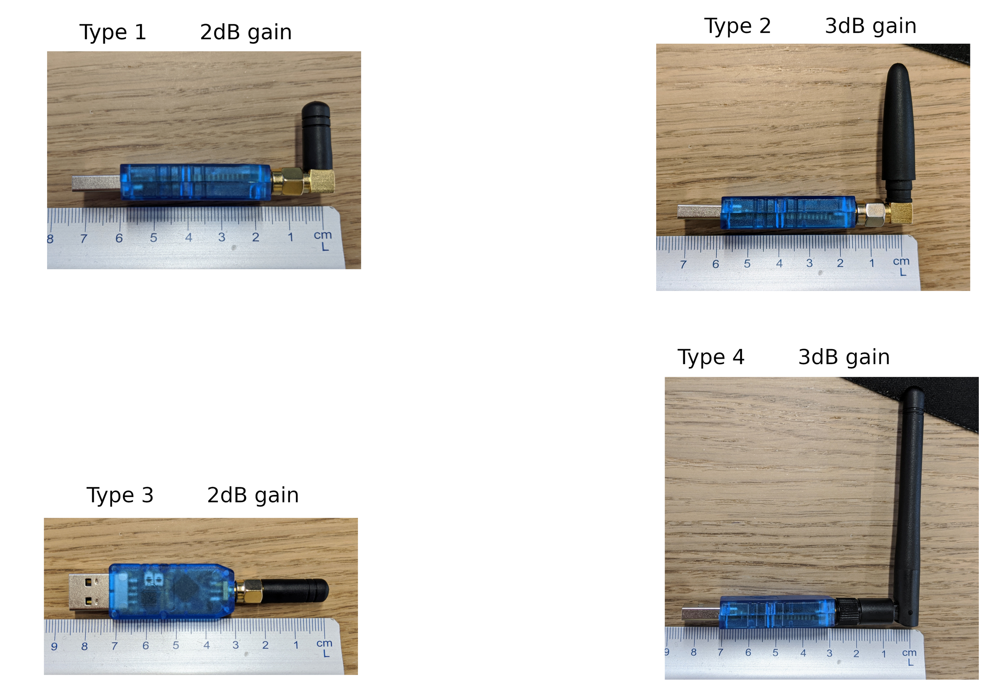
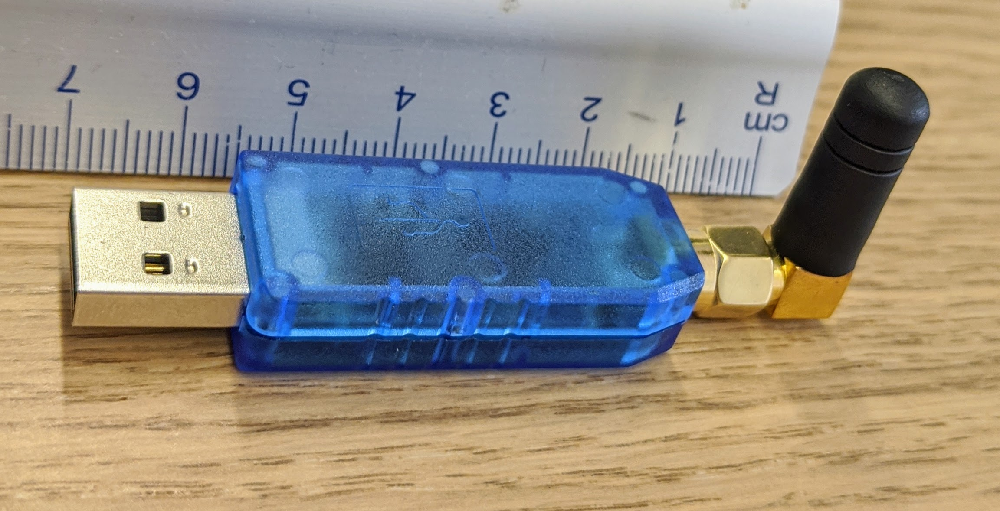
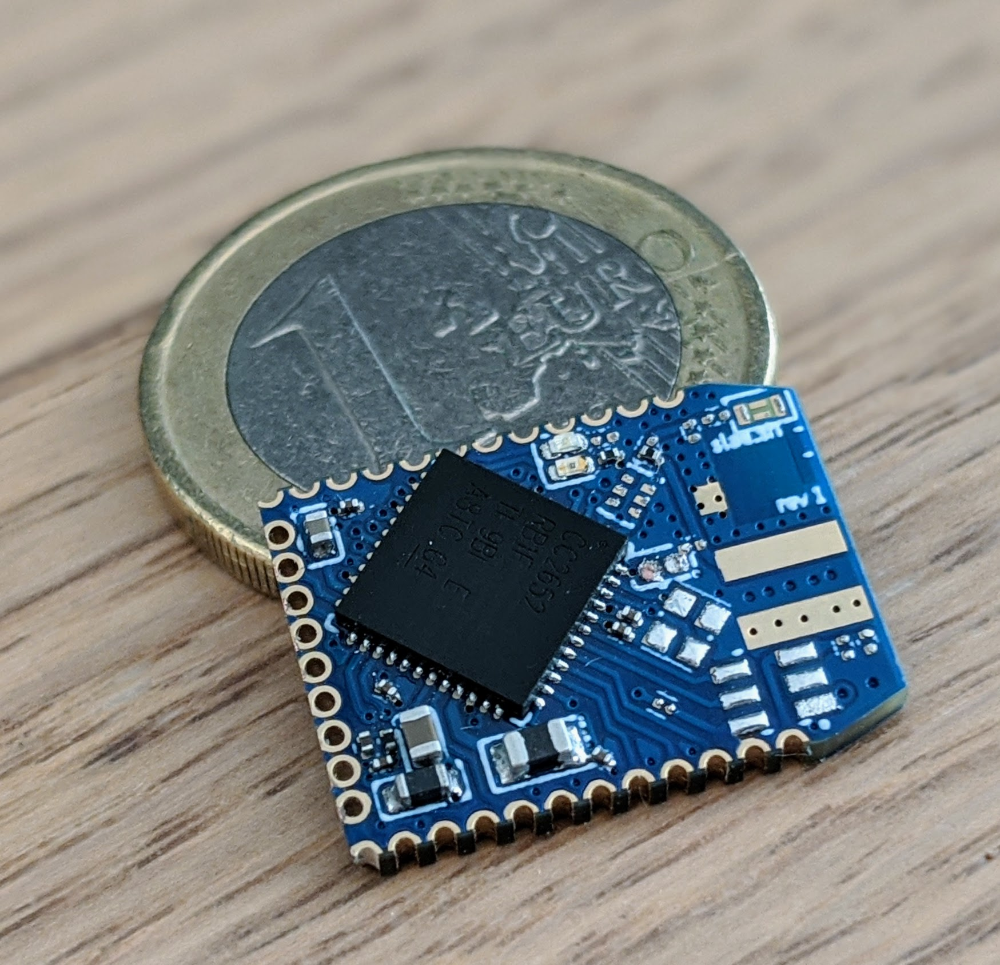
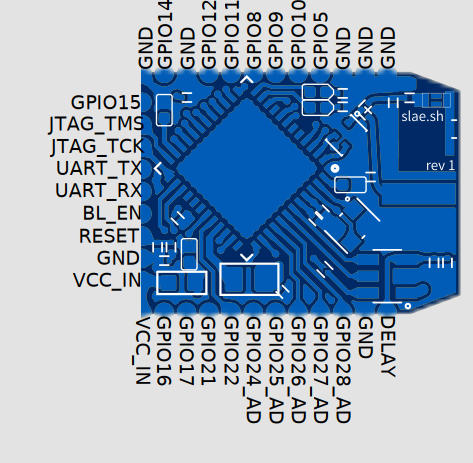
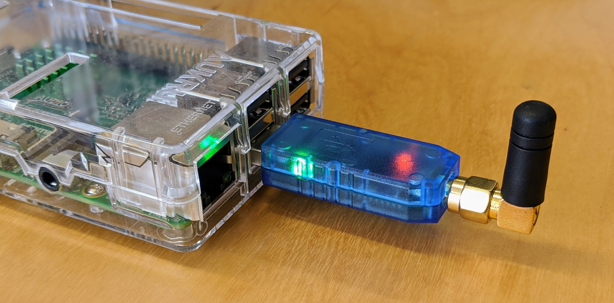
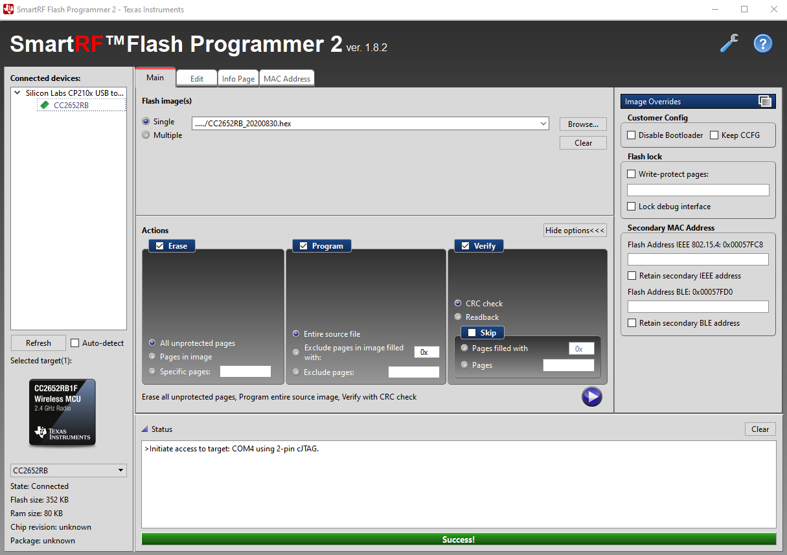
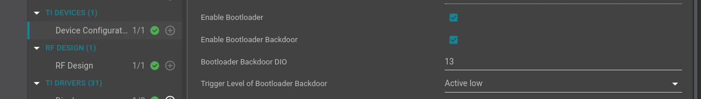
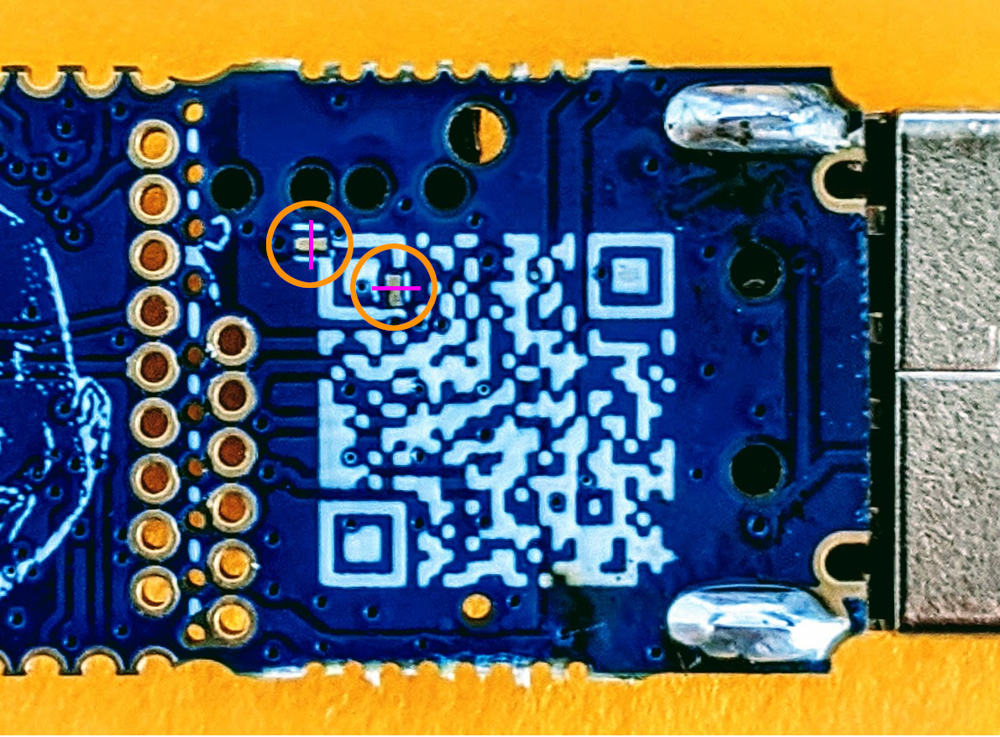

# CC2652RB development stick



!!! tip "what's so cool about it.."
    - super tiny CC2652RB multiprotocol 2.4 GHz development stick<br>
    - Ideal as ZigBee coordinator/router or as an OpenThread border router<br>
    - Low power capable for building battery powered devices<br>
    - Plug & Play, comes pre-flashed<br>
    - Deadly easy programming, thanks to the automatic-bootloader thing! ;)<br>
    - Made with <span class="twemoji tx-heart"> <svg xmlns="http://www.w3.org/2000/svg" viewBox="0 0 24 24"><path d="M14 20.408c-.492.308-.903.546-1.192.709-.153.086-.308.17-.463.252h-.002a.75.75 0 01-.686 0 16.709 16.709 0 01-.465-.252 31.147 31.147 0 01-4.803-3.34C3.8 15.572 1 12.331 1 8.513 1 5.052 3.829 2.5 6.736 2.5 9.03 2.5 10.881 3.726 12 5.605 13.12 3.726 14.97 2.5 17.264 2.5 20.17 2.5 23 5.052 23 8.514c0 3.818-2.801 7.06-5.389 9.262A31.146 31.146 0 0114 20.408z"></path></svg> </span> here in Cologne<br>

!!! info "projects realized.."
    - [BME680 air quality sensor](/projects/bme680/)

## The Stick

### Get one

Pretty easy ;)

<button
  class="snipcart-add-item"
  data-item-id="cc2652-stick"
  data-item-price="{&quot;usd&quot;: 29.49, &quot;eur&quot;: 26}"
  data-item-url="/projects/cc2652/"
  data-item-description="Openthread or ZigBee coordinator"
  data-item-image="/images/shippes_with.jpg"
  data-item-name="CC2652RB stick (USB-A)"
  data-item-custom1-name="external antenna type"
  data-item-custom1-options="Type 1[+1.5]|Type 2[+1.5]|Type 3[+1.5]|Type 4[+1.5]|I have my own"
  data-item-custom1-required="true"
  data-item-custom1-value="Type 2"
  data-item-custom2-name="firmware"
  data-item-custom2-options="zigbee2mqtt|OpenThread|I dont care"
  data-item-custom3-name="OPTIONAL: pin-headers (not pre-soldered)"
  data-item-custom3-options="No, thanks.|Yes, please[+3]"
  data-item-custom4-name="Message"
  data-item-custom4-type="textarea"
  data-item-custom5-name="tip"
  data-item-custom5-options="None, thanks! :)|1[+1]|2[+2]|5[+5]|10[+10]|15[+15]|20[+20]">
  Just click here to buy one!
</button>

!!! tip "STOCK"
    - If this button is orange, and clickable.. We have stock!
    - And will ship within the next 1-4 days. Depending on the incoming orders.
    - We are shipping from Cologne, Germany - using DHL and the local post of targets country..
    - This way of ordering is our preferred one. Much easier for us and faster for you! ;)
    - We are new in building a webshop.. If something is missing, just get in touch with us!

Currently we are only supporting PayPal as an instant payment-method. If you preferr something else, just use the "Deferred"-method.
We are highly working on other solutions like Mollie and or Bunq support! :)

Or use Tindie: (back somewhat in January, currently testing this shop here)

https://www.tindie.com/products/slaesh/cc2652-zigbee-coordinator-or-openthread-router/

Or just send us a [mail].

Thanks for supporting us!! =)

For us, the easiest way would be to use this shop here. ;)

### Antenna types



### Dimensions



Fully assembled with the smallest antenna its around 7cm longs.

The whole stick itself measures around 50x14mm.

The CC2652RB breakout part will be around 18x14mm.

It's smaller than a CR2032 coin cell! And can easily powered by one for multiple years :fontawesome-regular-grin-hearts:



### Pinout

Nearly all free usable pins of the CC2652R are accessable through the pin-headers.



2x12 and 1x9 1.27mm pin-headers

### LEDs

  - Blue: general purpose (GPIO6)
  - Orange: general purpose (GPIO7)
  - Green: power LED (3V3)

### Antenna

It can be shipped in two antenna-options:

  - SMA-connector (female, whole) -> so you can use any SMA (male, pin) antenna!
  - on-chip antenna

## ZigBee coordinator



!!! hint
    Now officially listed on [https://www.zigbee2mqtt.io/information/supported_adapters.html#slaeshs-cc2652rb-stick](https://www.zigbee2mqtt.io/information/supported_adapters.html#slaeshs-cc2652rb-stick)

It's easy to use with the popular [zigbee2mqtt] project from [koenkk]!<br>
Many thanks to him and his awesome work! :fontawesome-regular-grin-hearts: <br>
After getting my fixed costs, we will reward him with every sold ZigBee-stick!

!!! info
    You can just replace your less powerfull CC2531/CC2538 or what ever stick you used before..<br>
    .. with this new powerfull CC2652R device!

!!! warning
    For the images the stick is plugged into the PC/Pi directly to show its dimensions.
    Better DO NOT do it like this, use a USB-Extension cable instead!!<br>
    See further [explanation here].

### Installation

#### Firmware

##### Download

If you already oredered it with the correct firmware, skip this and [continue here](#zigbee2mqtt).

Download the correct FW, using the z-stack firmware 3.x.0:

###### from koenkk

https://github.com/Koenkk/Z-Stack-firmware/tree/master/coordinator/Z-Stack_3.x.0/bin

We will need the CC2652 **RB** file.

Download and extract.

###### from me

This is just for debugging purposes.. Or if you like LED's ;D

Download this firmware file [znp_CC2652RB_20200715.bin](http://slae.sh/downloads/znp_CC2652RB_20200715.bin).

Main difference to koenkk's version:

  - LED's (blue and orange) are turned **ON** at startup.
  - the orange one will blink on each received UART character.

##### Flash

Use this [guide below](/projects/cc2652/#flashing).

#### zigbee2mqtt


Just start it as usual.
See the following documentation: https://www.zigbee2mqtt.io/#getting-started

!!! warning
    We need at least [version 1.14.2](https://github.com/Koenkk/zigbee2mqtt/releases/tag/1.14.2)!

!!! warning
    When migrating from another dongle (e.g. CC2531), make sure to modify your pan_id in your [configuration](https://www.zigbee2mqtt.io/information/configuration.html), otherwise Zigbee2mqtt won’t start.<br>
    If there is no entry `pan_id`, please create one using any other number than `0x1a62`! This is the default one, if there is no one setup.<br>
    You have to re-pair your devices then, cause we created a new network.

#### Homeassistant / Hass.io

There is this super cool hassio add-on from [danielwelch](https://github.com/danielwelch/hassio-zigbee2mqtt)!

Which let's us use the zigbee2mqtt as an easy to use add-on.

[Here](https://smart-home-assistant.de/zigbee2mqtt-installieren/) is a really good installation guide.

!!! warning
    As described above, we need to take care to use at least [version 1.14.2](https://github.com/Koenkk/zigbee2mqtt/releases/tag/1.14.2) of [koenkk]'s [zigbee2mqtt]!


!!! warning
    Another thing we need to take care of, is to use the "long" serial-port names!<br>
    Do ***NOT*** use the syntax like `/dev/ttyUSBx`.<br>
    Instead use the one like `/dev/serial/by-id/usb-Silicon_Labs_slae.sh_cc2652rb_stick_-_slaesh_s_iot_stuff_00_12_4B_00_21_A8_E3_95-if00-port0`!
    <br><br>
    Why should we do this?<br>
    Cause the serial-port using the enumerated-syntax can (and may will) change!<br>
    Using the `/dev/serial/by-id/....` syntax will never change.<br>
    And docker, or the running linux, will find the correct associated serial-port for our device! ;)
    <br><br>
    How can we check the correct name?<br>
    Go to the `Hass.io/Supervisor`-tab, go to `System` and click on the `Hardware`-button.
    <br><br>
    And please do this for all other USB-devices you are using, even in other add-on's. :)

## OpenThread border router


You can also easily use it as a OpenThread border router!<br>
Together with the use of [wpantund] you can control and publish your local OpenThread network.

[wpantund] will connect to the stick flashed with the OpenThread border router FW and will create a local network interface!
this can then easily be used to communicate to OpenThread devices simply by using their IPv6 addresses :fontawesome-regular-grin-hearts:

### Installation

Just flash the following file:

http:// ..

as described [here](/projects/cc2652/#flashing).

## Flashing

There are multiple ways to flash:

  - [JelmerT's serial bootload tool] *recommended*
  - TI's flashing tool [UniFlash] *v6.x.x or higher!*
  - TI's flashing tool SmartRF Flash Programmer2
  - Using a JTAG-Adapter

### Serial bootloader tool

!!! tip "automatic bootloader"
    You dont have to put the CC2652RB manually into the bootloader mode<br>
    Its done by the tool automatically!<br>
    So no need to reopen the enclosure for flashing..

#### Determine com-port

On windows, use this in a Powershell:

```
$comports = Get-WMIObject Win32_SerialPort; $comports | Get-PnpDeviceProperty -InstanceId {$_.pnpdeviceid} -Keyname DEVPKEY_Device_BusReportedDeviceDesc | ForEach-Object { foreach($comport in $comports) { if ($comport.pnpdeviceid -eq $_.instanceid) { new-object psobject -property  @{COMPORT = $comport.deviceid; 'Device-Name' = $_.data} } } }
```

On linux, use this:

```
ls -l /dev/serial/by-id
```

#### flash it

  - Install [python](https://www.python.org/downloads/)
  - Use ```python --version``` to be sure, that you are running python 3 or above!
  - If you are **NOT** running **3.4** or higher, you need to install `pip`, too.
  - Install dependencies with ```pip install pyserial intelhex```
  - Download the [cc2538-bsl.py] file or just clone the repo.<br>
```
git clone https://github.com/JelmerT/cc2538-bsl.git
```
  - Open the directory containing the python-script
  - Open a command line there or just navigate into the folder
  - Type in this command to flash your image to the stick:<br>
```
./cc2538-bsl.py -p “comport” -evw “fw-file”
```

!!! info
    -e will erase the chip<br>
    -w writes the file into flash<br>
    -v will verify the checksum

#### Smart RF Flash Programmer2

To use this tool, we need to put the Chip manually into the Bootloader.

This is done by pressing the buttons in a specific way:

  - Press and hold the bootloader-enable button (nearest to the chip, marked with small "BL")
  - Just press/click the reset-button (nearest to the usb-connector, marked with small "RST")
  - The bootloader-pin can be released.

The Chip will check during the startup the bootloader-enable-pin. If its "set", the bootloader is executed. Otherwise the Application would start!



!!! warning "check disable bootloader checkbox"
    Do NEVER EVER click the Checkbox called "disable bootloader".<br>
    Otherwise we aren't able to flash again!<br>
    Please just take a quick look everytime, that it is NOT checked! ;)


## Development

This stick is a great starting point if you want to get in touch with the 2.4 GHz technologies:

  - ZigBee
  - OpenThread
  - Bluetooth 5 (BLE)
  - any custom RF protocol based on IEEE 802.15.4

You can get ready in just a few minutes and send your first packets through the air!! =)<br>
.. and thats really satisfying ;D

### Enviroment

There is at least one way to programm and debug the CC2652R devices:

  - CCS - Code Composer Studio from TI

You can download the latest version [here].

It shippes with so many example projects! For all possible protocols.

!!! warning "BOOTLOADER SETTINGS"
    TAKE CARE WHILE FLASHING!<br>
    To use the auto-bootloader and flashing via USB you need to take care that the embedded bootloader is enabled and the Backdoor-Pin is routed to GPIO-Pin **13** and ***active low*** !<br>
    Otherwise it's not possible to flash via USB!!    
    
    

My blinky demo can be found [here](https://github.com/slaesh/cc2652-stick/tree/master/example-projects/blinky).

## Trouble shooting

### Checking the functionality and reading fw-version

To test the stick just run this scipt: [https://github.com/slaesh/cc2652-stick/tree/master/coordinator-test](https://github.com/slaesh/cc2652-stick/tree/master/coordinator-test).

Maybe do it twice, if it fails the first time.

### zigbee2mqtt isn't working

koenkk and i needed to add some code to work properly, cause of the auto bootloader schematic.

So first of all, check which version of zigbee2mqtt you are running currently! See those [hints](#zigbee2mqtt).

If updating is not resolving your issue, please download this [firmware](http://slae.sh/downloads/znp_CC2652RB_20200715.bin) for the stick.

And flash it using the [guide above](/projects/cc2652/#flashing).

This FW is a coordinator, too. But will turn both LED's (blue and orange) **ON** at startup!

The orange one will blink everytime the stick receives any character via UART.

So we can use this for debug purposes:

  - Plug the Stick -> LED's should be both ON!
  - Start zigbee2mqtt
  - If both LED's will turn off during starting zigbee2mqtt we don't have the correct version or some bad settings!
  - Check your `configuration.yaml` to NOT include `rtscts: true` in the `advanced` section.

Still struggling? just get in touch with me: [mail@slae.sh](mailto:mail@slae.sh) !!

### can't get any serial debug messages

Your serial monitor need to release RTS and DTR.

Like on a unix-system, using miniterm:

```
miniterm.py /dev/ttyUSB1 230400 --rts 0 --dtr 0
```

Will open the ttyUSB1 with a baurdrate of 230400.

The RTS signal is connected to the RESET-Pin and DTR is connected to the Bootloader_Enable-Pin!<br>
If you dont wan't this behavior, you can destroy/cut the solder-pads underneath..



## HW files

https://easyeda.com/mxii.monxii/cc2652rb_minimalistic

## Licenses

Hardware License: Solderpad 2.0<br>
Software License: GPL v3<br>
Documentation license: CC BY 4.0<br>

## Contact

Send us an [mail](mailto:mail@slae.sh)

Or text us on [Telegram](https://t.me/slaesh) for urgent requests and technical support!

[explanation here]: https://www.zigbee2mqtt.io/how_tos/how_to_improve_network_range.html#connect-the-cc2531-using-an-usb-extension-cable
[mail]: mailto:order@slae.sh
[zigbee2mqtt]: https://github.com/Koenkk/zigbee2mqtt
[koenkk]: https://github.com/Koenkk
[JelmerT's serial bootload tool]: https://github.com/JelmerT/cc2538-bsl
[cc2538-bsl.py]: https://github.com/JelmerT/cc2538-bsl/blob/master/cc2538-bsl.py
[here]: https://software-dl.ti.com/ccs/esd/documents/ccs_downloads.html#code-composer-studio-version-10-downloads
[UniFlash]: https://www.ti.com/tool/UNIFLASH
[wpantund]: https://github.com/openthread/wpantund
