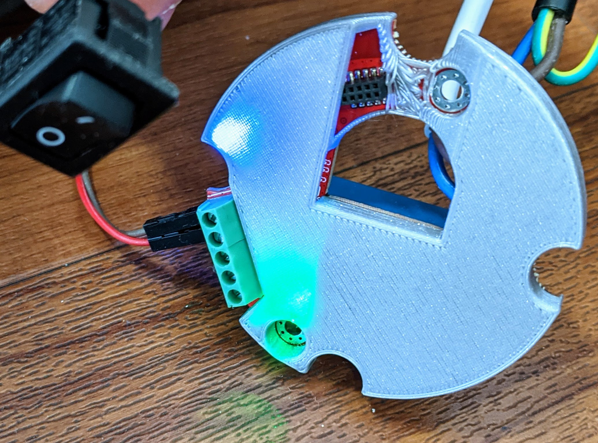
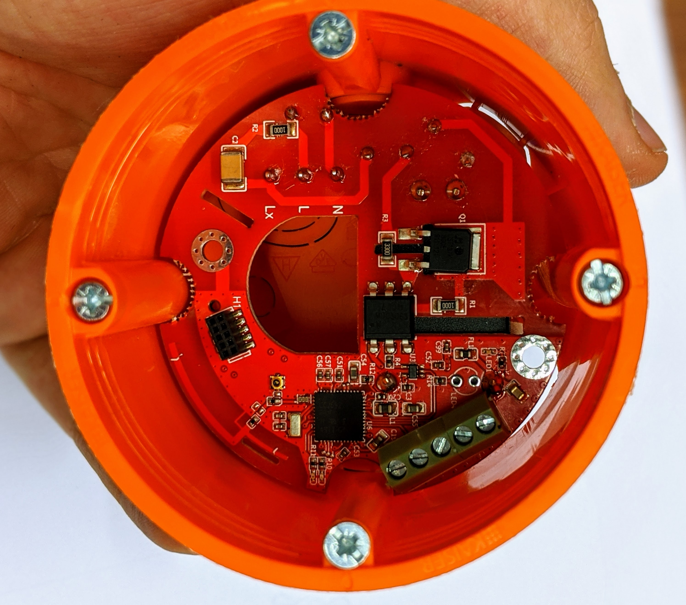
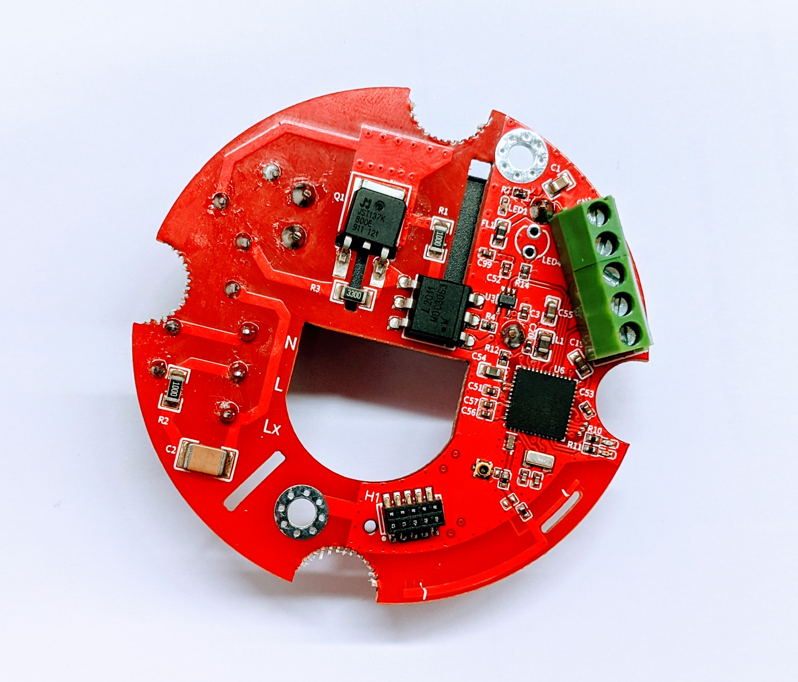
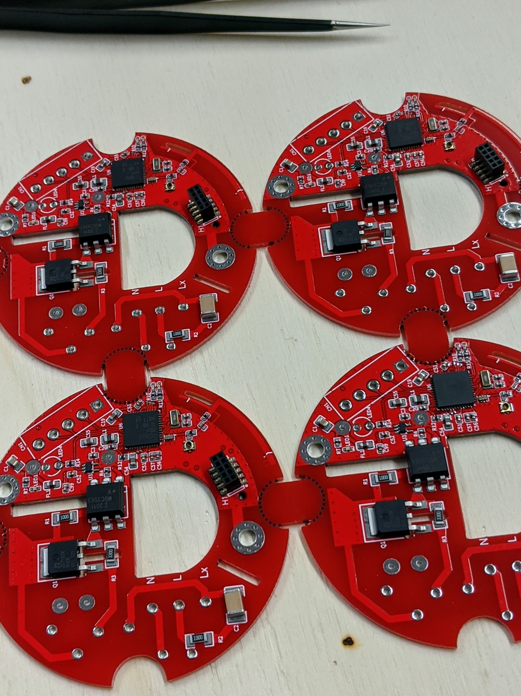

# flush mounter relay pill

Why:

- CC2652RB powered, OpenThread and ZigBee capable
- switching 230V AC, smart but hidden! ;)
- could also work as light actor, with or without the relay part (4 inputs)
- also operates as router

Join the list and let's see if we can push this topic!!

   <label for="waitinglist_emailinput">email</label>
   <input id="waitinglist_emailinput" type="text" />
   <button
   class="cta__button"
   id="join_waitinglist"
   onClick="joinWatchlist('unterputz_start', 'unterputz_relais')">
   Join waitinglist..
   </button>

