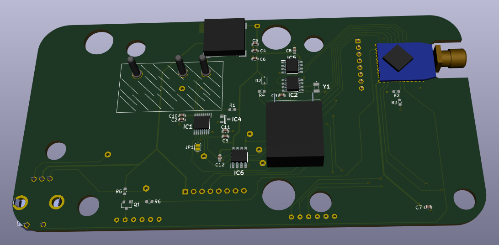
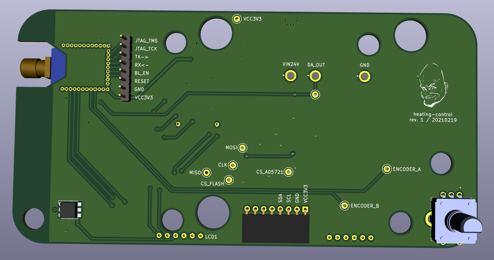
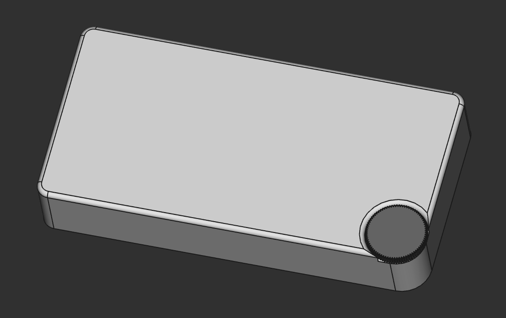
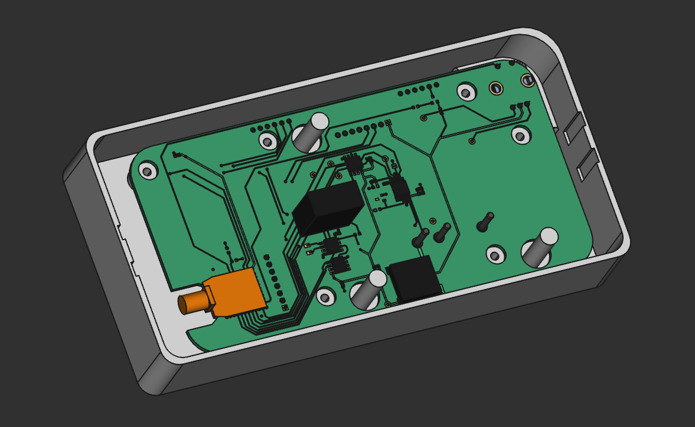
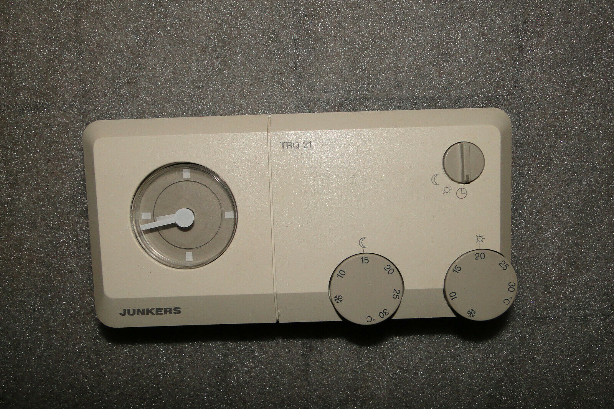

# heating-controller - TRQ21 replacement

Why:

- tired of switching the heater every day on and off manually..
- build KiCad skills
- extend FreeCad skills (PCB import, part-models and the enclosure)

Parts:

- [CC2652 stick](/projects/cc2652/)
- FRAM (for configuration)
- RTC
- Digital-to-Analog converter (0-20 V)
- Flash (for OTA updates)
- APA102 RGB LED
- (optional) there's a possibility for a LCD display

Will replace this beauty here .. ;D

