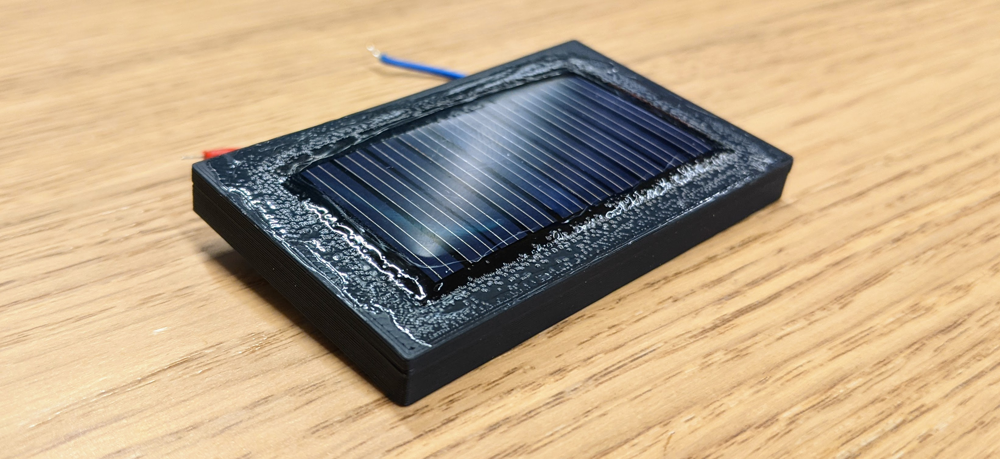
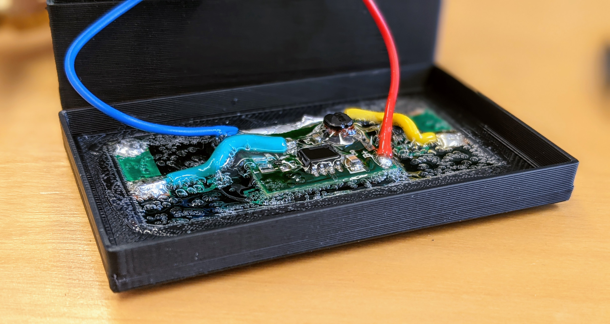
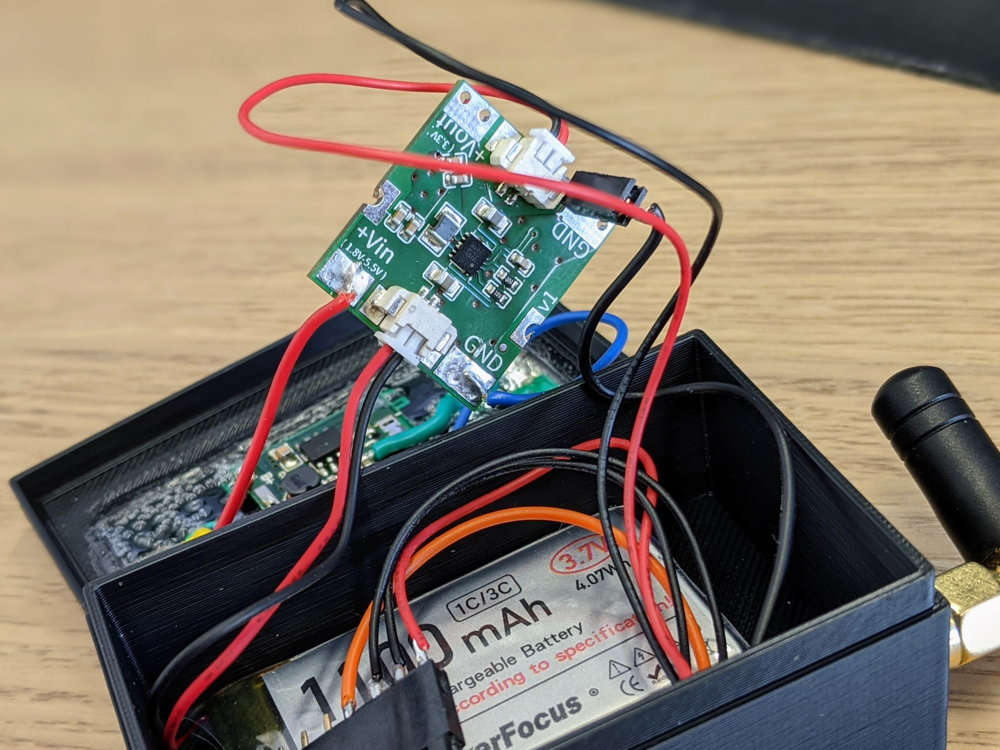
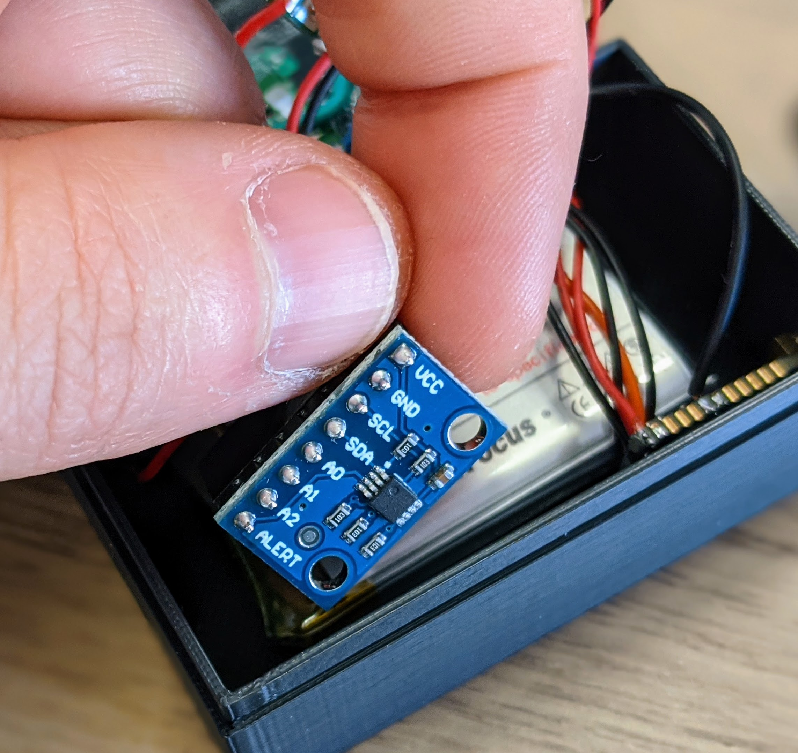
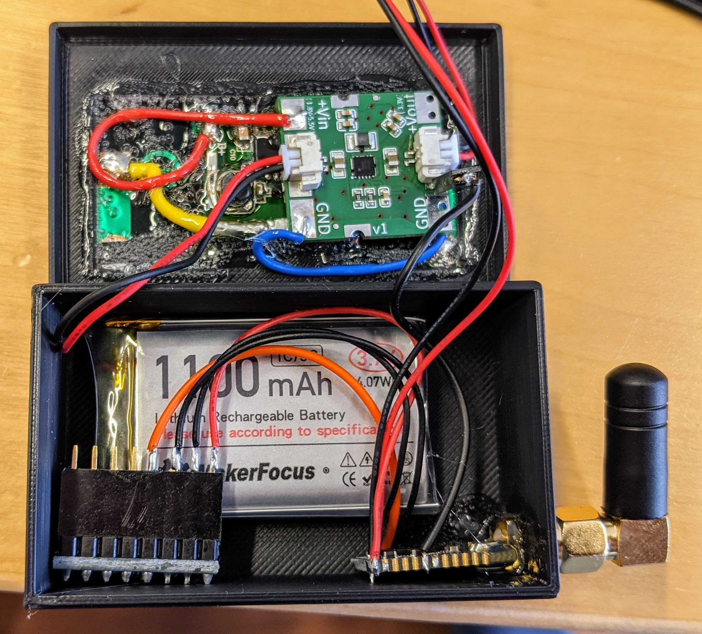
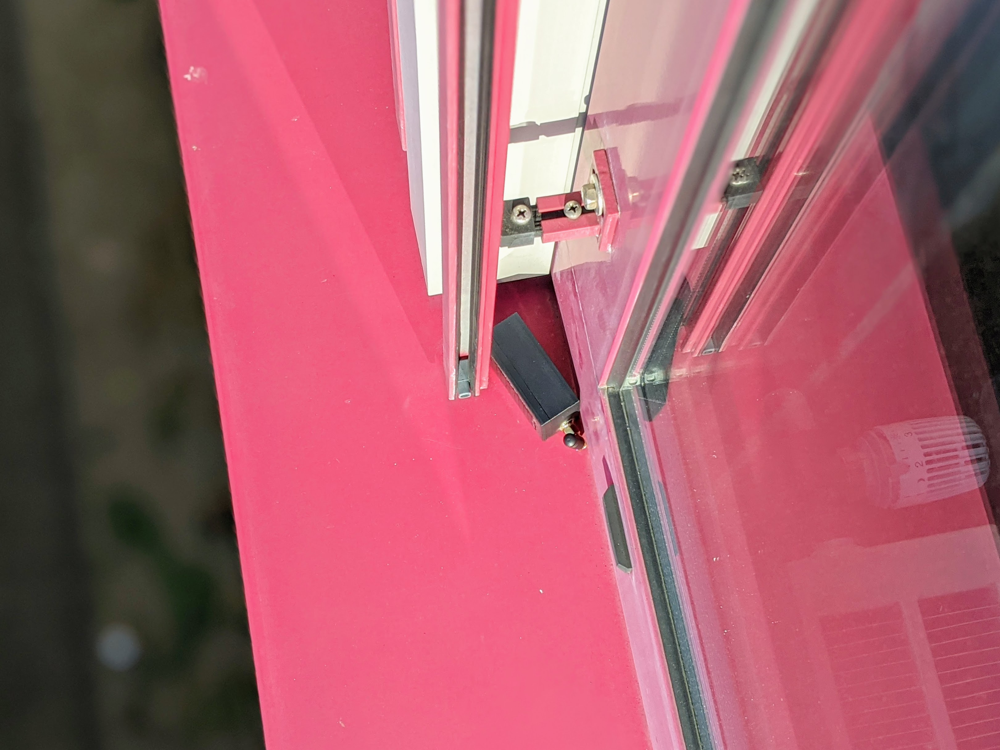
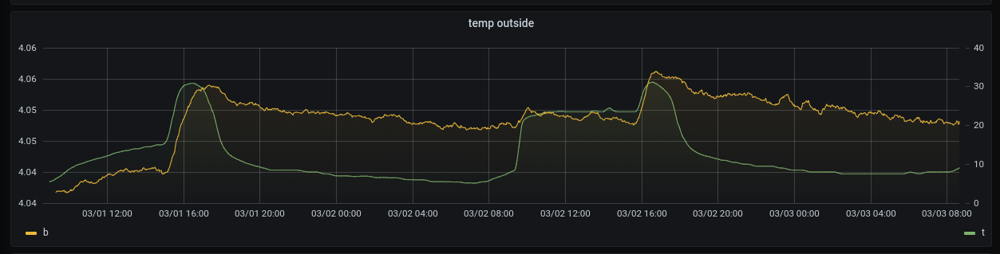

# low power, lipo powered temperature sensor

Why:

- first battery powered device using [our stick](/projects/cc2652/)
- .. and our new [buck-boost converter board](/projects/rp605) !
- playing around with lipo's and solar modules
- it's just pretty cool to see the graphs :D

Parts:

- [CC2652 stick](/projects/cc2652/)
- [RP605 buck-boost converter](/projects/rp605)
- [MCP9808 temperature sensor](https://amzn.to/30abWoi)
- [LiPo battery](https://amzn.to/3uO1l0l)
- Solar panel (max. 5V)
- LiPo charging board
- [some glue..](https://amzn.to/306Gl6X) ;D

this sensor is sending every minute the current temperature, using the OpenThread stack.
informations are forwarded via MQTT, then blown into the an influxdb and visualized via a grafana dashboard.

even without the solar panel, the sensor should be powered with this huge [1100mH LiPo](https://amzn.to/3uO1l0l) for multiple years.. and with.. yeah, it could life "forever"? ;D

printed a enclosure for this, not really shiny and nice, but works for the start.. =)

as mentioned above, just used some glue to make it "water proof" .. or maybe better "rain proof" ! ^^

after some tests we just glued the charging board into the top:

here is our new cool [RP605 buck-boost converter](/projects/rp605) in action:

the [MCP9808 temperature sensor](https://amzn.to/30abWoi):

literally.. all glued together! =D

and will now just sit here in front of our office window.. ;)

.. aaaand finally the graphs! thanks to the beauty and easyness of grafana..

could spend the whole day starring at those graphs.. =D

And as you can see, the battery voltage (yellow), goes UP.. So it charges more than consuming.. pretty cool though!

Downside: temperature gets up, once the sun kisses the sensor. maybe not a black enclosure could help.. 