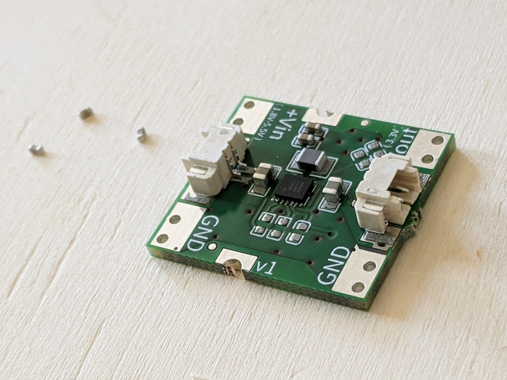

# buck-boost converter, perfect for battery powered devices!

Why:

- ulta low current operation
- battery monitor included
- dont waste money on expensive chips which can be powered with less than 3V ..
- easy to go power management and possibility to just use "any" battery ;)
- optional CR2032 holder on the backside

We are thinking about to produce more than just those few boards for us..
Could be a cool impulse to kick you off and build your own battery powered devices!!

If it is so, just join the list and if we reach like 50 or more people.. We will go for it! ;)

   <input id="waitinglist_emailinput" type="text" />
   <button
   class="cta__button"
   id="join_waitinglist"
   onClick="joinWatchlist('rp605_start', 'rp605')">
   Join waitinglist..
   </button>

Price would be around 5€, just to tell a number ..

.. more informations are coming soon .. depending on the waitinglist growth ;)

