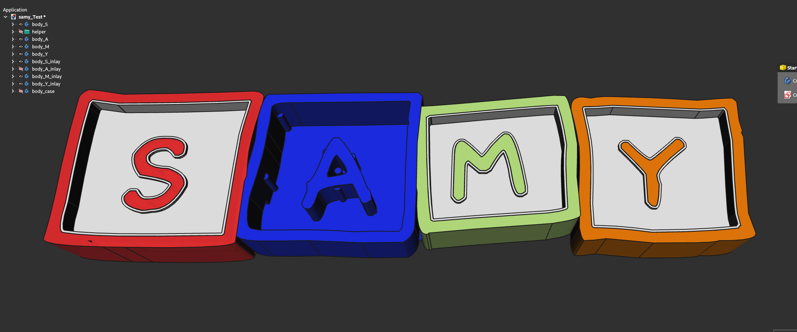
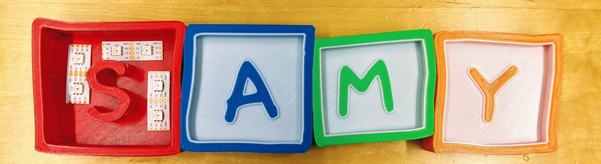
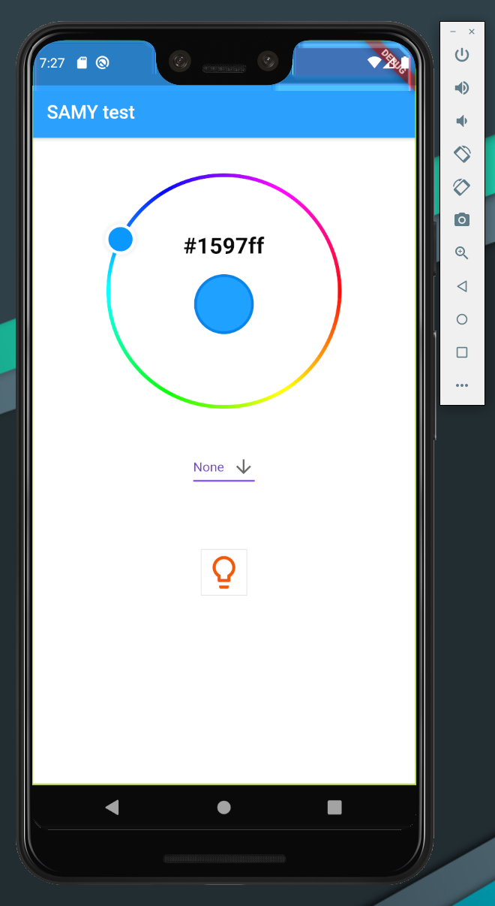
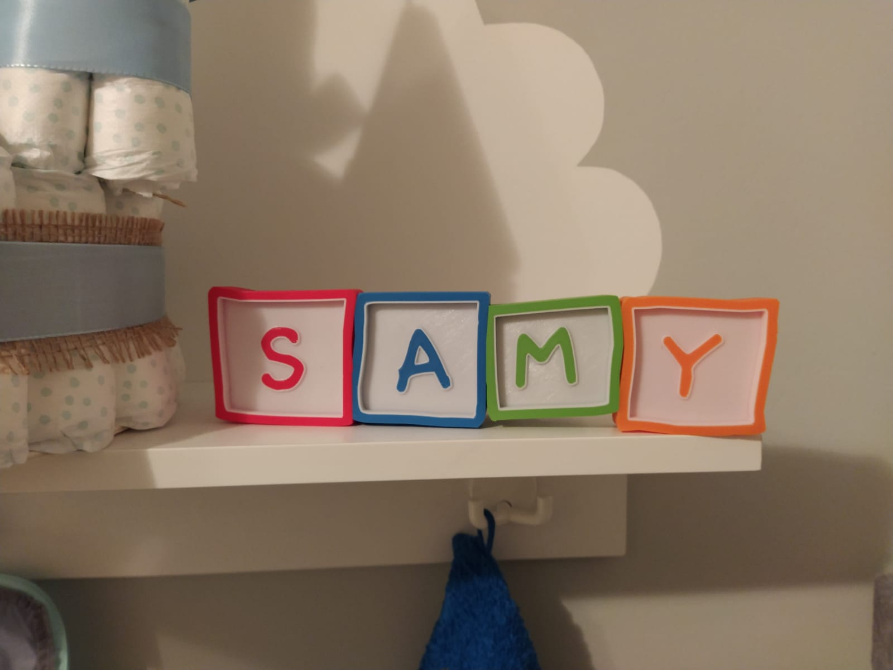

# the SAMY project ! :D

So far the CAD.. Got inspired by this [video](https://www.youtube.com/watch?v=3Mkf67_ZnEM)!!
Thanks going out to Duke for his awesome content!

Just took another font.. And made it a bit more complicated with the letter in the Middle..

Buuut, was a really good journey and learned a lot!! Definitly got some FreeCAD skills :P .. SOME !!

I used the [linkstage3-branch](https://github.com/realthunder/FreeCAD) from realthunder!! Awesome, awesome work!!

Aaaaaand, that is the result:

PLA used, jus the good old amazon basic stuff.. Really nice to work with, nothing needed to tweak!

   

   

   

   

   

As LED's I choose the APA102! So we can easily and fast control each RGB LED on it's own!!

Really wanted to use our [CC2652RB-stick](/projects/cc2652) as the controlling unit.. But I would have to install a Raspberry Pi, too.
That my sis and her husband can control the light.. So I just stick with this, a Wemos D1 mini, ESP8266 based.

Using the WiFiManager, its super easy to connect and via OTA I can easily deploy updates!

I just created a minimal [esp-update-service](https://github.com/slaesh/esp-updater), to keep it simple to update it via remote!
Written in golang and used as a docker container.

The light will be controllable via MQTT, running a Mosquitto 2.0 broker "in the cloud".

And the GUI is a really simple Flutter app:

with just three controls: 

 - color
 - border
 - on/off

the result:

